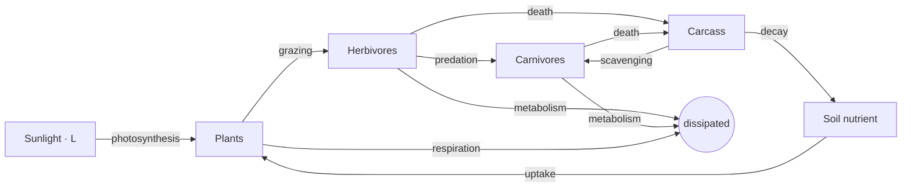
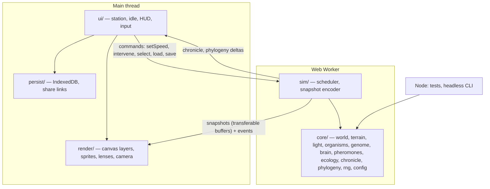

# Flatland — Technical Specification

**Status:** Draft v0.1 · September 2026
**Author:** Eric Mann
**Target:** `flatland.eamann.com` (Cloudflare Pages), Android later
**Sibling project:** [Helioza](https://github.com/ericmann/helioza) — this document assumes familiarity with it and reuses its conventions where they fit.

---

## 0. How to read this document

This is a specification, not a plan. It says what Flatland *is* and what constraints it must satisfy. The build plan is derived from it separately (see Appendix A for the planning prompt). Sections marked `⚠️ ASSUMPTION` contain numbers or choices that are best guesses and are expected to move during tuning; everything else is a decision.

Reading order for someone new: §1 (concept) → §3 (engineering principles) → §4 (world) → §6 (architecture) → §9 (testing). The GUI (§5) is documented in the interactive mockup at `docs/mockup.html` as much as here.

---

## 1. Concept

Flatland is a browser-native artificial-life ecosystem: a tile-based 8-bit world in which organisms hunt, graze, breed, evolve, and die, with no goal and no player character. It is a **super advanced digital ant farm** — the fun is in watching, naming, and occasionally interfering.

It is the successor to Helioza. Helioza is organisms orbiting a star on a continuous plane; Flatland is organisms living on terrain with geography, closed energy, real day and night, seasons, and stigmergic communication. Where Helioza's behaviors are largely written, Flatland's are largely **evolved**: a continuous-weight genome drives a small brain, and pheromone channels have no fixed meaning until selection gives them one.

Three properties define the experience and every design decision below serves at least one of them:

1. **Stakes.** Energy is conserved. A lineage that overgrazes its valley starves. Extinction is permanent and logged. Nothing spawns from nowhere after genesis.
2. **Legibility.** Evolution must be visible without opening an inspector: sprites are generated from genomes, lineages are colored, trails glow, night is dark. Every world event has a plain-language sentence and a place name.
3. **Indifference.** The sim does not care about the viewer. The idle mode is the default. The Hand of God is small and every intervention is written into the record.

### 1.1 Non-goals

- No win condition, score, progression, or unlockables.
- No multiplayer, no server-side simulation, no accounts.
- No hand-authored species behaviors beyond the reflexes needed to bootstrap (eat when on food, die at zero energy).
- No 3D, no physics engine, no continuous-plane movement. Tiles.

---

## 2. Audience and surfaces

| Surface | Timing | Notes |
|---|---|---|
| `flatland.eamann.com` — desktop browser | Phase 0 onward | Primary development target. Keyboard + mouse. |
| `flatland.eamann.com` — mobile browser | Phase 0 onward | Touch-first: pinch, drag, tap. Must be a first-class citizen from the first deploy, not a responsive afterthought. |
| Installable PWA | Phase 4 | Offline, home-screen icon, standalone display. This is the bridge to Android. |
| Android (Play Store) | Future, out of scope | Via Trusted Web Activity (Bubblewrap) wrapping the PWA. Capacitor only if native APIs become necessary. See §10. |

The Android future is out of scope for the build but **in scope for the design**. §10 lists the concrete constraints it imposes now.

---

## 3. Engineering principles

These are the rules the implementation is reviewed against. They are ordered by how expensive they are to retrofit.

1. **Deterministic core.** Given a seed and an ordered intervention log, the simulation produces byte-identical state at every tick, on every platform. No `Math.random`, no `Date.now`, no floating-point order-of-iteration surprises in the core. This is what makes replay, sharing, and regression testing possible. It is tested (§9.2).

2. **The core has no DOM.** `src/core/**` imports nothing from the browser. It runs unchanged in Node (tests, headless harness), a Web Worker (production), and the main thread (debugging).

3. **Simulation and rendering are separate processes.** The sim runs in a Worker at a fixed timestep. The renderer receives snapshots and never mutates simulation state. UI intent (interventions, selection, speed) flows the other way as messages. This is what keeps the UI at 60fps on a phone while the sim runs at 16×.

4. **A world is a seed plus its history.** Save files, share links, and test fixtures are all `{ seed, config, interventions[] }`. Full state snapshots exist only as a cache for fast resume. This keeps share URLs tiny and makes every bug reproducible from a link.

5. **Structure of arrays, not array of structures.** Organisms live in typed arrays indexed by slot (`x[i]`, `y[i]`, `energy[i]`, `genome[i*G..]`). Tiles are flat `Float32Array`/`Uint8Array` grids. Snapshots to the renderer are transferable buffers. No per-organism object allocation in the hot loop.

6. **Every intervention is an event.** The Hand of God, naming a lineage, changing a config value mid-run — all are appended to the intervention log and written to the chronicle. There is no back door that mutates state silently.

7. **Config is data.** All tunables live in one typed config object with documented units and defaults. Tests override config rather than reimplementing formulas. Tuning changes are diffs to defaults, not code changes.

8. **Tests before tuning.** Mechanics are tested in isolation (one mechanic on, everything else off), then in long seeded soak runs asserting ecological invariants. Tuning that breaks a soak invariant is a regression, not a vibe.

9. **Offline-first, network-free at runtime.** No CDN, no fonts from Google, no analytics, no fetches after load. The bundle is the app. This is required for the PWA and Android and it is also just correct for a sim.

10. **Small PRs with acceptance tests.** Each implementation task has a stated acceptance test that exists before the code does. A PR that adds a mechanic without a test that isolates it is incomplete.

---

## 4. The world

### 4.1 Space

A fixed rectangular grid of tiles. Coordinates are tile units; organisms have continuous positions within the grid (`Float32`), which rounds to a tile for terrain and resource lookups.

| Parameter | Default | Notes |
|---|---|---|
| `world.width` × `world.height` | 256 × 160 tiles | `⚠️ ASSUMPTION` — sized for ~300–600 organisms on a phone. Must be configurable; tests use 64 × 40. |
| Tile size on screen | 4 px at zoom 1 | Camera zoom 1–8, integer-snapped for crisp pixels. |
| Edges | Hard walls | No wrapping. Edges are where immigration arrives (§4.9). |

### 4.2 Terrain

Generated from seeded multi-octave value noise, thresholded into six types. Terrain is mostly static; the Hand of God and (in a later phase) rivers can change it.

| Type | Movement cost | Visibility | Grows plants | Notes |
|---|---|---|---|---|
| Water | impassable for non-swimmers | — | no | Swimming is a genome trait (Phase 3+). Until then, a hard barrier. |
| Sand | 1.0 | exposed (×1.3 detection) | no | Shoreline. |
| Mud | 1.6 | normal | low cap | Wet margins; carcasses persist longer. |
| Grass | 1.0 | normal | high cap | The commons. |
| Scrub | 1.3 | **hides** (×0.45 detection) | medium cap | The hiding spots. Predators must be closer to detect prey here. |
| Rock | 1.5 | exposed | no | Barren; meteor craters become rock. |

Generation must produce, for the default size, at least one contiguous grassland ≥ 8% of the map and at least one water body ≥ 2%, or re-roll with `seed+1` and log it. `⚠️ ASSUMPTION` on thresholds.

### 4.3 Time and light

Time advances in integer ticks. Light is **one global scalar** `L ∈ [0,1]` computed from the tick; nothing else about the sky is modeled.

```
DAY      = ticks per day            (default 1800 ⚠️)
YEAR     = days per year            (default 24 ⚠️)
u        = (tick mod DAY) / DAY     -- 0 at dawn
yearFrac = ((tick / DAY) mod YEAR) / YEAR
f        = 0.5 + 0.22 · sin(2π · (yearFrac − 0.125))   -- day fraction; peak mid-summer
L        = u < f  ?  ½ · (1 − cos(2π · u / f))  :  0
```

- Seasons are named quarters of the year: Spring, Summer, Autumn, Winter, with the longest day at mid-summer and the shortest at mid-winter.
- The displayed clock is the world's own: `Year Y · Day D · HH:MM`, where `06:00` is dawn (`u = 0`). A day is 24 world-hours regardless of `f`; only the lit fraction changes.
- **Temperature** (Phase 5): a lagged, smoothed function of `L` plus a seasonal offset — thermal mass — so nights are cold and winter nights colder. Metabolic cost scales with the gap between an organism's preferred temperature (a gene) and ambient.
- **Weather** (Phase 5): rare discrete events, not a continuous system. Rain (moisture pulse to tiles), fog (temporary global vision penalty). Each is a chronicle entry.

### 4.4 Energy

Energy is conserved. The only source is sunlight; the only sink is metabolism (heat). The accounting identity below is a test invariant (§9.2).

```
Σ plants + Σ organism energy + Σ carcass + Σ soil  +  dissipated  ==  genesis + Σ sunlight input
```

Flow:



- **Plants** are a per-tile scalar `p ∈ [0, cap(terrain)]`. Growth per tick: `g · L · (1 + k_soil · soil) · (1 − p/cap)`. Grazing removes from `p` and adds to the grazer at efficiency `η_herb`; the remainder is dissipated. `⚠️ ASSUMPTION` on `g`, `k_soil`, `η_herb`.
- **Carcasses** are per-tile scalar mass. Decay moves mass to `soil` at a rate that is slower on mud. Scavenging is a diet behavior (§4.6).
- **Diet is a continuous axis** `d ∈ [0,1]` (0 = obligate herbivore, 1 = obligate carnivore), as in Helioza. Assimilation efficiency for plant matter is `η_herb · (1 − d)`; for flesh, `η_carn · d`. Omnivores pay for their flexibility with lower efficiency at both ends.

### 4.5 Organisms

Each organism is a slot in the SoA store. Fields (non-exhaustive): position, heading, energy, age, species id, parent id, generation, sickness timer, genome, brain state (last inputs/outputs for the inspector).

**Lifecycle**

- Born from a parent with a mutated copy of the genome, receiving a fraction of the parent's energy (asexual by default; `⚠️ ASSUMPTION`: mating with crossover is Phase 3, gated on kin proximity and a sociality gene).
- Ages every tick. Death at `energy ≤ 0`, at `age > lifespan(genome)`, or by predation. Death leaves a carcass on the tile.
- Breeding requires `energy > threshold(genome)` and `age > maturity(genome)`, and is **density-dependent**: breeding probability is scaled by `max(0, 1 − N_local / K_local)` where `N_local` counts organisms within a radius. This is the carrying-capacity mechanic; it is not a global population cap.

**Senses**

Vision is a curve, not a radius. Each organism has a light peak `λ` and width `σ` (genes); acuity at the current global light is `a = exp(−((L − λ)/σ)²)`, and effective vision range is `R · (0.25 + 0.75 · a)`. Detection of a target is further scaled by the target's tile visibility (§4.2). This single mechanic produces nocturnal, crepuscular, and diurnal niches without any of them being written.

Other inputs are listed in §4.7.

### 4.6 Genome

A fixed-length `Float32Array` of values in `[0,1]`, in two blocks:

1. **Trait genes** (each mapped to a phenotype range in config):
   size · speed · diet axis `d` · vision peak `λ` · vision width `σ` · vision range `R` · metabolism · lifespan · maturity · breed threshold · boldness · sociality · preferred temperature (Phase 5) · swim (Phase 3+) · disease resistance · hue · four pheromone emission gains · four pheromone sensitivities.
2. **Brain weights** — the weight matrix of the network in §4.7, flattened.

Mutation: every gene perturbed by `N(0, σ_mut)` with probability `p_mut`, clamped; a rare **large mutation** (`p_big`) perturbs by `N(0, 4σ_mut)`. Both rates are config. Hue mutates slowly so lineages stay visually coherent.

**Genetic distance** is the Euclidean distance over the trait block only (brain weights are excluded — they drift too fast and would fragment species). Distance is what defines kin and species.

### 4.7 Brain

A small feed-forward network, evaluated once per tick per organism. Sizes are config; defaults `⚠️ ASSUMPTION`: 14 inputs → 8 hidden (tanh) → 8 outputs.

**Inputs** (all normalised to `[0,1]` or `[−1,1]`):
light `L` · hunger `(1 − energy/max)` · age fraction · nearest-threat direction (sin, cos) and proximity · food gradient (sin, cos) and magnitude · kin density nearby · four sensed pheromone gradients (magnitude along heading) · terrain here (hides / exposed / cost) · a constant bias.

**Outputs**: turn (−1..1) · throttle (0..1) · eat (gate) · four pheromone emit strengths · breed willingness.

The brain does not decide *what* food or threat is; those are computed by the sim from diet and species. It decides what to do about them. `⚠️ ASSUMPTION`: a fixed reflex layer (eat if on food and hungry; can't walk into water) remains regardless of brain output so the genesis population survives long enough to evolve.

### 4.8 Pheromones — the swarm layer

Four scalar channels per tile (`Float32Array` × 4), each with a global decay rate and a diffusion rate. Organisms **emit** into channels (gene-scaled, brain-gated) and **sense** the local gradient of each (gene-scaled). The channels have no fixed meaning: trail-following, alarm, mate-finding, territory marking, and deception are all things that can evolve. The ACO heritage is direct: this is stigmergy, and the "Trail scent" lens is the ant-colony animation driven by evolution instead of a hand-written rule.

Implementation: decay every tick (multiply); diffusion every `n` ticks via a 4-neighbour blur on a scratch buffer. Bounded cost: `O(tiles)` per step, independent of population.

### 4.9 Ecology and balance

The known failure mode (from Helioza's early builds) is a single lineage winning and staying dominant. Flatland relies on **frequency-dependent** pressures rather than caps:

- **Density-dependent breeding** (§4.5) — crowding suppresses births locally.
- **Disease** — a transmissible state spread by contact, with severity scaled against the resistance gene. Transmission probability is higher between genetically similar organisms (`⚠️ ASSUMPTION`: `p · (1 − dist/dist_max)`), so monocultures are fragile.
- **Regrowth debt** — a tile grazed to zero regrows from a lower base for a while (soil depletion), so herds must move.
- **Seasons** — winter light starves the plants; lineages that cannot migrate, or store fat (size), thin out.
- **Immigration** — when total population in a diet class falls below a floor, a small group arrives at a map edge with genomes sampled from the extinct or nearest lineage plus large mutation. This is an *honest* mechanic: it is logged ("A herd crosses in from the western edge") and it is the only exception to "nothing spawns from nowhere". It exists so an idle world never goes permanently silent. `⚠️ ASSUMPTION` on floors.

**Speciation** is measured, not declared. Each species has a running centroid over the trait block. A newborn is assigned to its parent's species unless its distance to that centroid exceeds `θ_species`, in which case a new species is created with the parent species as ancestor. Species with zero living members are extinct (timestamp recorded, never deleted). This produces the phylogeny.

### 4.10 Names and places

Auto-generated names are part of the design, not placeholders.

- **Regions**: `the [northern|southern|] [western|central|eastern] [shallows|shore|marsh|meadow|scrub|rocks]`, from the position's third of the map and its terrain.
- **Species**: `<Region word> <Noun>` where the noun is drawn by diet (`Grazers, Browsers, Nibblers, Drifters, Herds` / `Stalkers, Hunters, Lurkers, Ambushers` / `Foragers, Rovers, Wanderers` for omnivores), unique within a world. Users can rename; renames are interventions (§3 rule 6).
- **Chronicle sentences** use both. Kills are aggregated per lineage per day ("A hard night for the Scrub Browsers — six taken by Meadow Ambushers") rather than logged individually, so rare events (splits, extinctions, migrations, interventions) stay visible.

### 4.11 Chronicle and phylogeny

- **Chronicle**: an append-only list of `{ tick, kind, text, place, subjects[] }`. Kinds: `genesis`, `split`, `extinct`, `migration`, `hunt-summary`, `famine`, `plague`, `intervention`, `naming`, `first` (first carnivore, first nocturnal, first crossing of water). Rendered as plain text; the idle ticker shows the newest entry; the station shows the last N with filtering by kind.
- **Phylogeny**: the species tree — `{ id, name, ancestor, born, died, hue, count }`. Rendered as a horizontal time tree. Hovering/tapping a branch highlights living members on the map.

---

## 5. The GUI

The interactive mockup at `docs/mockup.html` is the reference for layout, colour, type, and interaction; this section states the contract. Where the mockup and this text disagree, this text wins.

### 5.1 Two modes, one world

**Idle** is the default state. The station is something you open.

| | Idle | Station |
|---|---|---|
| Chrome | None. Full-bleed world, vignette. | Top bar, lens rail, inspector, dock. |
| Camera | Auto-camera drifts between points of interest (hunt, birth, herd, night); user pan/pinch overrides for ~10 s. | Manual. Follow-mode locks to a selected organism. |
| Text | Caption (kind + sentence), newest chronicle line, world clock, a one-line hint. | Everything. |
| Controls | Floating zoom/speed cluster, dimmed. | Same cluster, full opacity, plus top-bar speed. |
| Enter/exit | Any key, tap the map, or the hint link → station. `Esc` or the Idle button → idle. | |

Idle must look good on a wall monitor and on a phone left on a desk: light level tints the whole scene, dawn and dusk are visible from across the room, night is dark with a soft floor so silhouettes remain.

### 5.2 Station layout

Desktop grid: top bar (44 px) / lens rail (200 px) · world · inspector (300 px) / dock (190 px). Phone (< 900 px): top bar / lens strip (horizontal scroll) / world / dock; inspector becomes a bottom sheet that opens on selection.

**Top bar** — world name and seed, sun-arc glyph, world clock, season with light % and day %, speed (⏸ 1× 4× 16×), population summary (plants % · grazers · hunters · lineages living/total), Idle button.

**Lens rail** — Lenses are overlays on one map, toggled independently: *Night* (turning it off is night vision), the four scent channels as heat, *Energy density*. A separate *Color by* radio: Individual (genome hue) · Lineage · Energy · Age. A terrain legend.

**World** — canvas; drag to pan, pinch/wheel to zoom, hover tooltip (organism: lineage · goal · energy; tile: terrain · plant % · scent levels), tap to select. Selection ring on the selected organism; lineage highlight rings when hovering the phylogeny.

**Inspector** — for one organism: sprite at 3×; editable lineage name; diet badge, generation, id; current goal and place; energy and age bars; vision peak with classification (nocturnal < 0.35 ≤ crepuscular ≤ 0.7 < diurnal) and current acuity; live brain inputs as bars; genome trait block as a radial glyph; family (species ancestry, parent, living siblings, offspring, living kin, lineage birth); Follow / Close.

**Dock** — tabs: *Chronicle* (filterable), *Phylogeny* (live tree), *Charts* (population per lineage; diversity index with light-cycle area fill; trophic energy flow in Phase 4), *Hand of God*. A *Design notes* toggle exists in the mockup only.

**Floating cluster** (both modes, bottom-right of the world): zoom −/level/+ (level tap = fit world), speed ⏸/1×/4×/16×.

### 5.3 Hand of God

Deliberately small. Six tools: Fire (radius burn, kills), Meteor (permanent rock crater, kills), Plague (seed disease in radius), River (paint water), Meadow (paint grass), Rain (global plant boost). Each is an intervention event: appended to the log, replayed deterministically, and written to the chronicle with a ⚡ prefix. No spawn tool. No delete-organism tool.

### 5.4 Input contract

| Action | Mouse/keyboard | Touch |
|---|---|---|
| Pan | drag | one-finger drag |
| Zoom | wheel, `+` `−`, cluster | pinch, cluster |
| Fit world | `0`, tap zoom level | tap zoom level |
| Select | click | tap |
| Speed | `space` pause, `1` `2` `3`, cluster | cluster |
| Lenses | `L` night, `T`/`A`/… scent channels | rail chips |
| Station ↔ idle | any key / `Esc` | tap map / Idle button |

Keys must never trigger while an input has focus. On touch, no interaction may depend on hover.

### 5.5 Visual language

- Palette: deep moss ground `#0e1410`, panels `#151d18` / `#1c2620`, bone text `#d9d4c0`, sun accent `#e3a83a`, critical `#d8573f`, good `#7fbb6a`; scent channels each get a distinct hue.
- Type: pixel display face for labels and lineage names, monospace for data, a humanist sans for sentences. **All fonts are bundled** (§3 rule 9).
- Sprites are procedural from the genome: body size from `size`, hue from `hue`, eye pixel light or dark by vision peak, spines for high `d`, a tail for high sociality, a sick marker. Drawn at integer pixel scales only.
- Single committed dark theme. The page paints its own background; there is no light theme.

### 5.6 Sharing and persistence

- **Share link**: `?w=<base64url of {seed, configDiff, interventions}>`. Loading a link replays from genesis to the log's last tick, then continues live. Long logs are compacted by dropping intervention-free stretches into a "fast-forward N ticks" record.
- **Auto-save**: seed + log written to IndexedDB every N seconds and on `visibilitychange`; a state snapshot is cached alongside for instant resume. On reload, resume from snapshot and verify its hash against a short replay in the background (`⚠️ ASSUMPTION`: 2,000 ticks) — a mismatch means a determinism bug and is surfaced in the console, never silently ignored.
- **Gallery** (future): a static list of curated share links on eamann.com. Not part of this app.

---

## 6. Architecture

### 6.1 Overview



### 6.2 Modules

```
src/
  core/        pure simulation, no DOM, no timers
    rng.js         seeded PRNG (mulberry32 or xoshiro128**); the ONLY randomness source
    config.js      typed defaults + units + validation
    noise.js       value noise for terrain
    terrain.js     generation, terrain tables, region naming
    light.js       tick → L, season, clock
    world.js       World class: grids, organism store, step()
    organisms.js   SoA store: alloc/free slots, fields
    genome.js      layout, mutate, distance, phenotype mapping
    brain.js       forward pass over SoA
    senses.js      threat/food/kin/pheromone inputs
    pheromone.js   channels, decay, diffuse, gradient
    ecology.js     plants, carcasses, soil, disease, immigration, breeding
    species.js     centroids, assignment, phylogeny
    chronicle.js   event log + sentence generation
    names.js       region and lineage naming
    save.js        {seed, config, interventions} ↔ serialisation; snapshot encode/decode; state hash
  sim/
    worker.js      message loop, fixed-timestep scheduler, snapshot encoder
    protocol.js    typed message definitions shared with main
  render/
    renderer.js    layer composition, camera, DPR handling
    terrain-layer.js, organism-layer.js, lens-layer.js, sprites.js
  ui/
    app.js         mode state machine (idle/station), wiring
    station/*.js   top bar, rail, inspector, dock panels, charts
    idle.js        auto-camera POI selection, caption
    input.js       pointer/pinch/keyboard → commands
  persist/
    db.js          IndexedDB wrapper
    share.js       URL encode/decode
  main.js
public/            index.html, manifest, icons, bundled fonts
scripts/           headless.mjs, sweep.mjs, tune.mjs
test/              unit, invariants, soak, ui
docs/              SPEC.md (this), mockup.html, deployment.md, development.md
```

### 6.3 The step

```
step():
  tick++ ; L = light(tick)
  plants.grow(L, soil) ; carcass.decay() ; pheromone.decay(); if tick % n == 0: pheromone.diffuse()
  grid.rebuild()                                  -- spatial hash, cell = 8 tiles
  for each living organism i (in slot order):
      inputs  = senses.gather(i, grid, L)
      outputs = brain.forward(genome[i], inputs)
      act(i, outputs)                             -- move (terrain cost), eat, emit, breed intent
      metabolise(i, L, season)
      disease.tick(i, grid)
  resolve(): predation kills, births (density-checked), deaths → carcasses
  species.assignNewborns() ; species.markExtinct()
  ecology.immigration() ; chronicle.flush(tick)
  if tick % sampleEvery == 0: stats.sample()
```

Iteration order is slot order, always. Any operation that depends on neighbour order (predation contests) must resolve ties by lowest slot id. This is the determinism rule in practice.

### 6.4 Worker protocol

- **Fixed timestep** in the worker: `speed × 30` ticks per second, batched per `setTimeout(0)`/`MessageChannel` turn, with a budget of ~12 ms per batch; if the budget is blown, ticks are dropped from the *wall-clock target*, never from the simulation (the sim simply runs slower than requested and reports achieved TPS).
- **Snapshots**: at most one per animation frame requested by the main thread (`requestSnapshot`), returned as one transferable `ArrayBuffer` containing terrain (when dirty), plant/carcass grids, the four pheromone grids (when a scent lens is on), organism SoA slices needed for drawing (x, y, size, hue, species, flags), and the selected organism's full record. Double-buffered on the worker side.
- **Events**: chronicle entries, phylogeny deltas, stats samples — small JSON messages, sent as they occur.
- **Commands**: `load({seed, config, interventions})`, `setSpeed(n)`, `intervene(event)`, `select(id)`, `requestSnapshot(flags)`, `snapshotState()` (for save), `hash()` (for tests).
- Fallback: if `Worker` is unavailable (some embedded WebViews), the same `sim/` scheduler runs on the main thread with a smaller tick budget. Both paths use the identical `core`.

### 6.5 Rendering

- Offscreen world canvas at `tiles × 4 px`; terrain drawn from an `ImageData` at 1 px/tile scaled 4× with smoothing off, re-rendered only when the terrain/plant layer is dirty (every ~6 ticks or on intervention).
- Organisms drawn as `fillRect` groups from the snapshot; ~600 sprites per frame is well within budget.
- Lens layers composited with `globalAlpha`; night as a tinted fill scaled by `(1 − L)`, plus a dawn/dusk warm band.
- Present: single `drawImage` of the world canvas at camera transform with `imageSmoothingEnabled = false`, DPR-aware, zoom snapped to `1/4`-pixel multiples.
- Charts on their own canvases, redrawn only when their pane is visible and data changed.
- `prefers-reduced-motion`: the auto-camera cuts instead of glides.

### 6.6 Build and tooling

Helioza ships plain ESM from `public/` with no build step. Flatland needs a bundler for three reasons: the Worker must be bundled for the WebView case, fonts and the manifest must be inlined/hashed, and the PWA service worker needs a precache manifest. The decision:

| Concern | Decision | Rationale |
|---|---|---|
| Language | JavaScript (ESM) with **JSDoc types**, checked by `tsc --noEmit --checkJs` | Type safety for the SoA layouts and message protocol without a compile step in the mental model; matches Helioza's plain-JS feel. |
| Bundler / dev server | **Vite** | Worker bundling, asset hashing, PWA plugin, trivial Capacitor/TWA path later. Output to `dist/`. |
| Tests | **vitest** (node env; jsdom for UI tests via docblock); **Playwright** for browser smoke tests | Same as Helioza plus real-browser input tests for pinch/tap. |
| Lint/format | eslint (flat config) + prettier | Keep Sonnet's output uniform. |
| Node | 22 LTS, pinned in `.node-version` and `engines` | As Helioza. |
| PWA | `vite-plugin-pwa`, `generateSW`, precache everything, `navigateFallback: index.html` | Phase 4. |

Scripts (`package.json`):

```
dev            vite
build          vite build
preview        vite preview
test           vitest run
test:watch     vitest
test:ui        playwright test
typecheck      tsc --noEmit
lint           eslint . && prettier --check .
headless       node scripts/headless.mjs
sweep          node scripts/sweep.mjs --seeds 1..40 --ticks 100000
```

---

## 7. Deployment — Cloudflare Pages

Follows Helioza's `docs/deployment.md` with one difference: there **is** a build step.

### 7.1 Dashboard setup (once)

1. Cloudflare dashboard → **Workers & Pages** → **Create Application** → follow the *legacy Pages* link (the Workers flow prefills a deploy command you don't want; the Pages flow asks for a build output directory).
2. **Connect to Git** → `ericmann/flatland`:

   | Field | Value |
   |---|---|
   | Production branch | `main` |
   | Framework preset | Vite |
   | Build command | `npm run build` |
   | Build output directory | `dist` |
   | Root directory | `/` |
   | Environment variable | `NODE_VERSION=22` |

3. Save and deploy. First build ~1 minute.
4. **Custom domains** → add `flatland.eamann.com`. The zone is on Cloudflare; it creates the proxied `CNAME flatland → flatland.pages.dev` and the certificate itself. Wait for *Active*.

### 7.2 Preview deployments

Every branch and PR deploys to `<branch>.flatland.pages.dev`. Design review happens on these URLs; a PR is not mergeable until its preview has been opened on a phone.

### 7.3 Headers

`public/_headers` (copied into `dist/` by Vite):

```
/*
  X-Content-Type-Options: nosniff
  Referrer-Policy: no-referrer
  Cache-Control: public, max-age=0, must-revalidate
/assets/*
  Cache-Control: public, max-age=31536000, immutable
```

No COOP/COEP: the design does not rely on `SharedArrayBuffer`, and setting those headers would complicate the Android WebView case.

### 7.4 CI

`.github/workflows/test.yml`: on push to `main` and every PR — `npm ci`, `npm run typecheck`, `npm run lint`, `npm test`, `npm run build`, then Playwright smoke against `vite preview`. The soak test (§9.3) runs on every PR; the 40-seed sweep runs nightly and on demand.

### 7.5 Command-line deploy (fallback)

```
npm run build && npx wrangler pages deploy dist --project-name flatland
```

---

## 8. Performance budget

Measured on a mid-range Android phone (`⚠️ ASSUMPTION`: Pixel 6a class) in Chrome, default world size, 400 organisms:

| Metric | Budget |
|---|---|
| Frame time, main thread | ≤ 8 ms at 1×; UI never below 50 fps at 16× |
| Sim throughput, worker | ≥ 480 ticks/s (16× real time at 30 tps) |
| Sim throughput, Node (CI gate) | ≥ 2,000 ticks/s on a GitHub runner, 64×40 world, 200 organisms |
| Memory | ≤ 150 MB total; no per-tick allocation in `core` (verified by a heap-growth test) |
| Cold load | ≤ 1.5 s to first painted frame on 4G; bundle ≤ 400 kB gzipped including fonts |
| Battery | Sim pauses on `visibilitychange: hidden`; idle-mode snapshot rate drops to 30 fps |

A PR that regresses the Node throughput gate by >10% fails CI.

---

## 9. Testing

Tests are the project's spine. The build plan should treat each item below as a deliverable with the same weight as the feature it covers.

### 9.1 Unit tests (`test/unit/*.test.js`, node)

One file per core module. Each mechanic is tested in isolation by building exactly the state it needs through `test/helpers.js` (`makeWorld({ size, terrain, organisms, config })`) and stepping the real `World.step()` with unrelated mechanics disabled via config — never by reimplementing a formula. Examples:

- `light`: `L(dawn) = 0`, peak at `u = f/2`, `L = 0` through the night, day fraction range over a year, clock string boundaries.
- `terrain`: seeded generation is stable; contiguity guarantees; region naming at the thirds boundaries.
- `genome`: mutation stays in bounds; big-mutation rate; distance is symmetric and zero for identical trait blocks; hue drift bounded.
- `brain`: forward pass matches a hand-computed 2-input toy network; SoA layout round-trips.
- `senses`: vision acuity curve; scrub halves detection; nocturnal organism sees farther at `L = 0.1` than a diurnal one.
- `ecology`: plant growth zero at `L = 0`; grazing transfers energy at `η`; carcass → soil → growth; density-dependent breeding; disease spreads by contact and preferentially among kin; immigration fires at the floor and is logged.
- `species`: newborn beyond `θ` creates a species with correct ancestor; extinction timestamp; centroid update.
- `chronicle`: kill aggregation per day; sentence generation for every kind; place names.
- `save`: encode/decode round trip; share-link compaction; snapshot hash is stable.

### 9.2 Invariant tests (`test/invariants/*.test.js`, node)

Property-style tests over seeded runs:

- **Determinism**: for seeds 1–10, two worlds stepped 5,000 ticks produce identical `hash()`; a world restored from snapshot at tick 2,500 and stepped to 5,000 matches the continuous run; a world *replayed* from `{seed, interventions}` with two interventions matches the original.
- **Energy conservation**: the §4.4 identity holds within `1e-3` relative error every 100 ticks over a 10,000-tick run with interventions.
- **No allocation**: `process.memoryUsage().heapUsed` after warm-up does not grow more than a fixed bound over 10,000 ticks.
- **Bounds**: no organism position outside the grid; no energy `NaN`; species counts sum to population.

### 9.3 Soak tests (`test/soak/*.test.js`, node, slow)

The Helioza `ecology.test.js` pattern, extended. For the pinned seed(s), run 100,000 ticks (≈ 2.3 world-years) and assert:

- Population never zero; herbivores and carnivores both present at the end.
- Living species ≥ 3 at the end and Shannon diversity averaged over the run ≥ `H_min` (`⚠️ ASSUMPTION`: 0.8).
- At least one speciation and at least one extinction occurred (the world is *doing* something).
- No single species exceeds 70% of the population for more than 20% of samples (the monoculture guard, made explicit).
- Vision peaks at the end are not all in one class (a nocturnal niche was found).

Pinned seeds are chosen by the sweep script, and the test file records why.

### 9.4 UI tests

- `test/ui/*.test.js` (jsdom): the app boots into idle; a key opens the station; commands reach the (mocked) worker; the inspector renders a selected record; the chronicle renders entries; keyboard shortcuts are ignored while an input has focus.
- `test/e2e/*.spec.js` (Playwright, Chromium desktop + Pixel 7 emulation): page loads with no console errors; first frame under budget; tap opens station; pinch changes the zoom label; drag pans; a Hand-of-God fire writes a ⚡ chronicle line; a share link reloads into the same clock and population; the PWA installs (manifest and service worker present).

### 9.5 Headless harness and sweeps

`scripts/headless.mjs` — as Helioza: run a seed for N ticks, print the ecology report (populations by diet and species, births/deaths by cause, speciation/extinction counts, diversity, vision-class histogram, achieved tps). `scripts/sweep.mjs` — one row per seed over a range, used to choose pinned seeds and to compare a tuning change across 40 seeds before and after. Tuning PRs must include the before/after sweep table in their description.

---

## 10. Designing now for Android later

Not building it. These are the design constraints it imposes on the current build, each already reflected above:

| Future need | Present decision |
|---|---|
| Runs in a WebView (TWA/Capacitor) | No `SharedArrayBuffer`, no COOP/COEP; Worker with a main-thread fallback; no CDN or runtime network. |
| Play Store listing via TWA | Installable PWA with a full manifest (name, icons incl. maskable, `display: standalone`, theme colour) and a service worker that precaches everything. `assetlinks.json` is a Phase-later addition and needs nothing now. |
| Touch is the primary input | Every action has a touch path (§5.4); hit targets ≥ 40 px; no hover-only affordances; pinch and one-finger pan are native, not library-provided. |
| Notches, gesture bars | `viewport-fit=cover`, safe-area insets on fixed chrome; floating cluster sits above the gesture bar. |
| Battery and background | Pause on hidden; snapshot cadence tied to `requestAnimationFrame`; no timers when not visible. |
| Persistence without a server | Save/resume through a `persist/` abstraction with one implementation (IndexedDB) so a Capacitor Filesystem adapter can be added without touching callers. |
| Small screens | Phone layout is designed, not derived: inspector as a bottom sheet, rail as a strip, dock at 170 px. |
| Memory ceilings | SoA typed arrays with fixed capacity (`config.maxOrganisms`), snapshots double-buffered, no per-tick allocation. |
| Native APIs (haptics, share sheet, wake lock) | Route through a tiny `platform/` adapter with a web implementation (`navigator.share`, `navigator.wakeLock`, no-op haptics). |

If native APIs are needed beyond what a TWA offers, Capacitor wraps the same `dist/` with no code changes to `core`, `sim`, or `render`.

---

## 11. Phases

Each phase ends in a deployable preview and a green CI. Order is by dependency, not by fun.

| Phase | Delivers | Exit criteria |
|---|---|---|
| **0 — Scaffold** | Repo, Vite, vitest, Playwright, eslint, CI, Pages deploy to `flatland.eamann.com`, `docs/`, mockup committed. `core/rng`, `config`, `light`, `noise`, `terrain` with tests. | A seeded terrain renders in the browser at the domain; determinism test for terrain passes. |
| **1 — Living world** | Organism SoA, fixed reflex behaviours (no brain yet), plants/carcass/soil energy loop, death, density-dependent breeding, worker + snapshot protocol, idle mode with auto-camera and light tint, floating cluster, headless harness. | Energy invariant test passes; soak test (reduced: 30k ticks, population survives); idle mode runs on a phone at budget. |
| **2 — Evolution** | Genome, brain, mutation, speciation, phylogeny, procedural sprites, station shell (top bar, rail, inspector, dock with chronicle + phylogeny). | Determinism with brains; soak asserts ≥ 1 speciation; inspector shows live brain inputs. |
| **3 — Swarm and pressure** | Pheromone channels + lenses, disease, regrowth debt, immigration, seasons' effect on plants, kill aggregation, all chronicle kinds, charts. | Full soak invariants (§9.3) pass on pinned seeds; sweep table in the PR. |
| **4 — Keep and share** | Save/resume, share links with replay, Hand of God, lineage naming, PWA, Playwright e2e suite complete. | Share-link replay determinism test; Lighthouse PWA installable; e2e green on Pixel emulation. |
| **5 — Weather and polish** | Temperature, rain/fog events, swimming gene, mating with crossover, reduced-motion, performance pass against §8 on a real phone, blog post. | §8 budgets met and recorded in `docs/performance.md`. |

---

## 12. Open questions

Tracked here so the planning pass can turn them into explicit decisions or spikes.

1. Is asexual reproduction with mutation enough for interesting evolution in Phases 2–3, or should crossover come earlier? (Helioza has crossover; it made lineages blur.)
2. Should the idle auto-camera keep a memory of past POIs so captions can carry narrative ("the same hunter, third night running")? Cheap to add in Phase 3 once the chronicle has subjects.
3. Do we want a *fog of war* variant of idle where you only see what some organism sees? Probably a later toy, but it interacts with lens design.
4. Snapshot verification on resume (§5.6) costs a background replay; is it worth shipping to users or is it a dev-only check?

---

## Appendix A — Prompts

Three prompts, for three roles. Each assumes this document is at `docs/SPEC.md` in the repository and that `docs/mockup.html` is present.

### A.1 Planning (Fable)

```
You are planning the build of Flatland, an artificial-life ecosystem sim. Read
docs/SPEC.md in full before doing anything else; it is the source of truth.
Open docs/mockup.html to understand the GUI.

Produce docs/PLAN.md: an ordered list of implementation tasks that a capable
but literal engineer (Claude Sonnet, working one task at a time with no memory
of previous tasks) can execute from the task text alone.

Rules for the plan:
- Follow the phases in SPEC §11 in order. Do not merge phases. Each phase ends
  with a task that deploys a preview and records what was verified on a phone.
- Every task is a single PR of ≤ ~400 lines of non-test code. Split anything
  larger.
- Every task states, in this order: Goal (one sentence), Files touched, Design
  constraints (cite SPEC sections by number), Acceptance tests (the exact test
  files and assertions that must exist and pass — write the test names), Out of
  scope (what the implementer must NOT do in this PR), Verification (commands to
  run, and for UI tasks, what to check in the browser and on a phone preview).
- Tests are written in the same PR as the code they cover, and invariant/soak
  tests are introduced as early as the mechanics they check exist — never
  deferred to a "testing phase".
- Where SPEC marks ⚠️ ASSUMPTION, the task must name the config key and its
  default and must NOT hard-code the number anywhere else.
- Every ⚠️ ASSUMPTION in SPEC gets, at the point it first matters, a tuning task
  that runs scripts/sweep.mjs before and after and pastes the table in the PR.
- Determinism (SPEC §3.1, §6.3) is a constraint on every task that touches
  core/. Say so in each such task's Design constraints.
- Resolve SPEC §12 open questions with a decision and one-line rationale at the
  top of PLAN.md, or turn one into a bounded spike task with a stated question
  and a time box.
- Also write CLAUDE.md for the repo: the engineering principles from SPEC §3
  condensed to a checklist, the commands, the module map, the determinism rule,
  the "no DOM in core" rule, the PR template (Goal / Tests / Sweep table if
  tuning / Phone verified), and a note that SPEC.md wins over PLAN.md wins over
  code comments when they disagree.

Do not write implementation code. Do write the test names. When you finish,
list anything in SPEC you found ambiguous or contradictory, with your proposed
resolution, at the end of PLAN.md under "Spec issues".
```

### A.2 Implementation (Sonnet, per task)

```
You are implementing one task from docs/PLAN.md for the Flatland project.
Read CLAUDE.md, then the task "<TASK ID AND TITLE>" in docs/PLAN.md, then the
SPEC sections it cites. Do not read ahead to later tasks.

Work in this order:
1. Write the acceptance tests named in the task first, and run them to confirm
   they fail for the right reason.
2. Implement the smallest change that makes them pass, within the Files touched.
3. Run: npm run typecheck && npm run lint && npm test. All green.
4. If the task touches core/: run npm run headless and confirm the report is
   sane; if the task is a tuning task, run the sweep before and after and put
   the table in the PR description.
5. If the task touches ui/ or render/: run npm run build && npm run preview and
   describe what you verified in the browser. Mark "Phone: not verified" — a
   human checks the Pages preview on a device.

Constraints you may not relax: no DOM or timers in src/core; no Math.random or
Date.now anywhere in src/core or src/sim; iteration in slot order with ties
resolved by lowest id; no per-tick allocation in the step; every tunable is a
config key; every intervention is an event in the log.

If the task is under-specified, do not guess silently: implement the
interpretation that is most consistent with SPEC, and record the choice in
the PR description under "Interpretation". If the task is impossible as
written, stop and say why rather than working around it.

Open a PR titled "<TASK ID>: <title>" using the template in CLAUDE.md.
```

### A.3 Review (Fable)

```
Review the PR for task "<TASK ID>" against docs/SPEC.md and docs/PLAN.md.
Read the diff, then the task, then the SPEC sections it cites. You have not
seen this code being written; do not assume it does what the description says.

Check, in order, and report findings most severe first:
1. Determinism: any Math.random, Date, iteration over Map/Set/object keys in
   core or sim, floating-point reductions whose order depends on data, or
   neighbour resolution without an id tiebreak.
2. Boundaries: DOM, timers, or fetch in core; sim state mutated from the main
   thread; config values hard-coded outside config.js.
3. Tests: do the acceptance tests named in the task exist, do they test the
   mechanic in isolation using config overrides rather than re-deriving the
   formula, and would they fail if the mechanic were removed? Run them. Run
   the invariant and soak suites if core/ changed.
4. Performance: per-tick allocation, O(n²) neighbour scans that bypass the
   spatial grid, snapshot buffers rebuilt per frame.
5. Spec drift: anything the diff does that SPEC says otherwise, or that PLAN
   marked out of scope for this task.
6. Only then: readability and naming.

Approve only if 1–3 are clean. For each finding give file:line, what is wrong,
what would break, and the minimal fix. If you conclude SPEC itself is wrong,
say so as a separate "Spec issue" rather than approving a deviation.
```